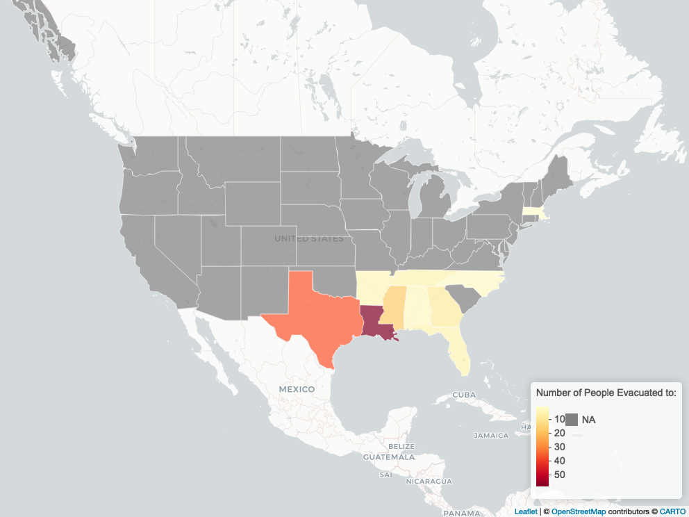

```{r setup, include=FALSE}
knitr::opts_chunk$set(echo = FALSE)
```

```{r, include=FALSE}
#packages
# Load all the packages needed here
library(tidyverse)
library(readr)
library(modelsummary) #to make nice tables and dataskim
library(here) #for file path simplicity
library(broom.mixed)
library(effectsize)
library(effects)
library(corrplot) #correlation matrix
library(leaflet) #map time
library(geojsonio)
library(rempsyc)
library(htmlwidgets)
library(webshot)
library(mapview)

```

```{r, include=FALSE}
hurricane <- read_csv("hurricanedisplacement2005.csv")
#fix data errors and change names to their abv
hurricane<- hurricane %>% 
mutate(across(where(is.numeric), ~abs(.))) %>%
  mutate(
   evac.state  = case_when(
      str_detect(evac.state, "GEORIGA") ~ "GA",
       TRUE ~ evac.state  # Keep the original value if none of the conditions are met
    )) %>%
  mutate(
   state.most.time  = case_when(
      str_detect(state.most.time, "OKLAHOMA") ~ "OK",
      str_detect(state.most.time, "FLA") ~ "FL",
       TRUE ~ state.most.time ))
#change to factor variables 
  hurricane <- hurricane %>% mutate(across(where(is.numeric), as.factor))
  hurricane <- hurricane %>% mutate("didmove"= ifelse(lives.NO.still == c("2","3"), 1, 0 ))
# labels for plots  
hurricane <- hurricane %>% mutate("didmove2"= ifelse(lives.NO.still == c("1"), "Moved Away", "Moved Back" ))
#fix race and work variables 
hurricane <- hurricane %>% 
  mutate("white" = ifelse(white == c("1"), "1", "0" )) %>%
  mutate("black" = ifelse(black == c("2"), "1", "0" )) %>%
  mutate("hispanic" = ifelse(hispanic == c("3"), "1", "0" )) %>%
  mutate("partime" = ifelse(partime == c("2"), "1", "0" )) %>%
  mutate("selfempfull" = ifelse(selfempfull == c("3"), "1", "0" )) %>%
  mutate("laidoff" = ifelse(laidoff == c("5"), 1, 0 )) %>% 
  mutate("selfemppart" = ifelse(selfemppart == c("4"), 1, 0 )) %>% 
  mutate("unemployed" = ifelse(unemployed == c("6"), 1, 0 )) %>% 
  mutate("disabled" = ifelse(disabled== c("7"), 1, 0 )) %>% 
  mutate("student" = ifelse(student == c("9"), 1, 0))
  hurricane <- hurricane %>% mutate(across(where(is.numeric), as.character)) 
  #fix race and work variables 
hurricane <- hurricane %>% 
  mutate("white" = ifelse(white == c("1"), "1", "0" )) %>%
  mutate("black" = ifelse(black == c("2"), "1", "0" )) %>%
  mutate("hispanic" = ifelse(hispanic == c("3"), "1", "0" )) %>%
  mutate("partime" = ifelse(partime == c("2"), "1", "0" )) %>%
  mutate("selfempfull" = ifelse(selfempfull == c("3"), "1", "0" )) %>%
  mutate("laidoff" = ifelse(laidoff == c("5"), 1, 0 )) %>% 
  mutate("selfemppart" = ifelse(selfemppart == c("4"), 1, 0 )) %>% 
  mutate("unemployed" = ifelse(unemployed == c("6"), 1, 0 )) %>% 
  mutate("disabled" = ifelse(disabled== c("7"), 1, 0 )) %>% 
  mutate("student" = ifelse(student == c("9"), 1, 0))
  hurricane <- hurricane %>% mutate(across(where(is.numeric), as.character))
```

## Introduction

As an Anthropologist, my central research focuses on the biological embodiment of environmental conditions, and how this embodiment affects overall health and wellbeing, both mental and physical. My main topics consist of the pathways and biological mechanisms in which this embodiment happens, understanding the larger circumstances causing environmental/biological stressors is becoming increasingly important. I also have interests in how environmental stressors inflict life change based on personal experience, and how these stressors can either lead to differing health outcomes. Long term, I want to examine resilience factors in this context, to understand what factors help decrease negative health outcomes in hopes of developing interventions. For the following project, I am working on the effects of natural disaster based displacement, examining risk factors for displacement and if displaced groups different in their mental and perceived overall health outcomes. As climate change is increasing the amount of natural disasters and increasing potential to induce large scale population movement (Oliver-Smith, 2009; McCarney & Kent 2020), understanding displacement from these events as a psychosocial stressor is necessary to be able to combat it and improve population health in times of uncertainty. Address risk factors of being in a displaced group also helps target interventions to those who may be more at risk.

To attempt to answer this question, I will be working with data from the Displaced New Orleans Residents pilot study. This data is publicly available and focuses on New Orleans (NO) residents who experienced Hurricane Katrina (HK) in 2005. Unfortunately, the data from the following study is only available upon request and I was not able to obtain access for this project. The pilot study data consists of survey data collected by phone, visits, and through mail throughout 2006, targeting residents in areas of the city affected by damage from HK. As the frequency of strong hurricanes (category 4/5) are theorized to increase (D. K. Cobb, Personal Communication, December 7, 2023) along with climate change, understanding hurricane related displacement in coastal areas is a target area for research on anticipated displacement.Survey questions included sociodemographic factors, hurricane impact related scales, and evacuation and displacement measures. Complete sample size for all questions is n = 131. Data does not contain any time series or real spatial points for neighborhood related analyses, aside from state evacuated to, preventing time series or spatial analysis techniques.

A growing body of work on natural disaster displacement patterns contends with the corresponding effect of displacement on mental health outcomes. In 1991, Morrow-Jones H. & Morrow-Jones C. (1991) report that there are significant differences in those who move due to a natural disaster compared those who move due to unrelated reasons. They report mixed potential effects of socio-economic status (SES) on displacement outcomes, stating that higher SES is usually related to a higher success of returning. However, the measurable effect of this has been ambiguous.The effect of homeownership is also ambiguous, as homeowners have less mobility than renters, but renters have less control over fixing residence damage. It has been suggested that as homeownership is associated with higher SES, that homeowners might have better outcomes when moving becomes a necessity. Black people have also been historically affected more by displacement during natural disasters, and this has been attributed to historical segregation of neighborhoods and damage patterns in those neighborhoods (Graif, 2016)\*\*.\*\* Other work on HK has demonstrated these patterns, so race is expected to be a significant factor in these models (Graif, 2016).

Morrow-Jones H. & Morrow-Jones C. (1991) also report a high incidence of depression and increased stress levels among displaced movers compared to non-displaced movers. Swartz et al. (2018), in a study of NY residents affected by Hurricane Sandy, found that displacement was also positively associated with a higher risk of developing PTSD. This mental health impact is also unequal among groups and those experiencing severe disability, experiencing disability or being displaced into a disaster shelter both increased the risk of negative mental health effects. Burrows et al. (2021) also found that higher income reduces the negative mental effects from displacement as well. Overall, displacement has been found to increase stress levels and result in poorer mental health outcomes, but more research is needed to clarify these relationships.

### Analysis

Burrows et al. (2021) was used as a reference for the analyses as preformed here. Burrows et al. implemented logistic regression models with sociodemographic factors to predict displacement and Welch Two Sample T-Tests to determine differences in mental health outcomes in displaced versus non-displaced groups.

#### Multivariate Logistic Regression

Burrows et al. (2021) examined displacement due to landslides in Indonesia, so while there is variability in data structure between their dataset and this one, I am their approach of using a binary outcome variable. I\\'ve created a binary outcome variable based on whether the individual in the sample relocated after HK or did not relocated (moved back or did not evacuate originally.) As for predictors, sociodemographic factors will be included as control variables, along with housing data, state moved to, and damage to residence from HK. Variables included were motivated by previous literature as described above. A model with an interaction effect between renting or owning and damage to residence is included to try and access the differing effect of residence damage based on ownership.The aim of this model is to identify risk factors associated with a higher probability of displacement to characterize displaced versus non displaced groups.

#### Welch Two Sample T-tests

Three t-tests were also ran to determine if significant differences in mental health outcomes exist between displaced and non displaced groups. The first t-test compared general stress scores between these groups in response to HK, a 10 point scale with 1 being least stressed and 10 being most stressed. For the second test, a depression score was calculated from q31-36 included in the survey data, aimed at quantifying depression symptoms to compare between groups, lowest scores indicate higher depression occurrence. For the third test, a health change score was calculated from before and after self rated health measures included in the survey, and change in health was compared across groups. Negative score represents perceived decrease in health after HK, and positive scores indicate a perceived increase in health.

### Results

#### Summary Tables and Figures

```{r}
hurricanestats <- hurricane %>% select(
  didmove2, 
  "Black" = black,
  "Hispanic" = hispanic, 
  "White" = white,
  "Level of School Completed" = schooling, 
  "Employed Full-Time" = fulltime, 
  "Employed Part-Time" = partime, 
  "Self Employed Full-Time" = selfempfull,
  "Self Employed Part-Time" = selfemppart,
  "Laid off from Job" = laidoff, 
  "Unemployed" = unemployed,
  "Disabled" = disabled, 
  "Student" = student, 
  "Own Home" = own.rent, 
  "Lived in Apartment" = apartment, 
  "Lived in Single Family House" = singlefam, 
  "Lived in a Duplex" = duplex,
  "Damage to Residence" = res.damage,
  "Income" = income
)

caption <- "Table 1. Compairison of Sociodemogrpahic and Housing/Hurricane Displacement Variables Between Moved and Moved Back Groups"

datasummary_balance(~didmove2,
                    data = hurricanestats,
                    title = caption)
```

Table 1. looks at summary statistics for each group. As shown by the sample sizes, more people moved away (n = 94) then moved back (n = 52) to NO after HK. Racial makeup of the sample seems roughly distributed among Black and White people, with more Black than White people reporting moving back to NO. A small portion of our sample reports experiencing disability (n = 10), so disability will be left out of our model due to sample size concerns, even if Swartz et al. (2018) found disability to be a significant predictor. 



Figure 2. looks at patterns of evacuations of NO residents in the sample after HK. Most residents evacuated within the state of LA (n = 58). The neighboring states of  TX (n =36) and MS (n = 17) had the next highest amounts of evacuees. The farthest dispersal was to MA, where a single individual reported relocating to. Most dispersal was located in the southeastern region of the US. 

#### Logistic Models

```{r}
#no interaction 
hurrmodel7 <- glm(didmove ~ age + sex  + white + black + hispanic + income + schooling + fulltime + partime + selfempfull + selfemppart + laidoff + unemployed + disabled + student + own.rent + evac.state + res.damage + own.rent*res.damage, family = "binomial", data = hurricane)
hurrmodel8 <- glm(didmove ~ age + sex  + white + black + hispanic + income + schooling + fulltime + partime + selfempfull + selfemppart + laidoff + unemployed + disabled + student + own.rent + evac.state + res.damage, family = "binomial", data = hurricane)
model_list = list(
  " With Interaction Between owning/Renting and Residance Damage" = hurrmodel7, 
   "Without Interaction"= hurrmodel8           )
modelsummary(model_list, stars = TRUE, caption = "Table 3. Multivariate Logistic Regression Model Predicting Moved Away/Moved Back to NO with Standard Errors")
```

There are not any significant differences between the interaction model and the non interaction model shown comparatively in Table 3. Neither owning/renting, damage to residence, and the interaction effect between the two were of statistical significance. Out of the other predictors, the only variable of significance (p = \< .05) in both models was having an income level of 3 (Moved Away n = 4, Moved Back n = 12) which consists of individuals in households making \$2,000 to just under \$3,000 after taxes per month. The comparison group for this sample is income level 1, consisting of those making a household income of \< 1000\$ a month. The odds ratio of income 3 for the non-interaction model is 137.4764 (95% confidence interval:[3.851375e+00 - 2.706765e+04], representing a 137.4764 times higher chance of moving away if the person\'s income level was in this group. The odds ratio of income 3 for the interaction model is  159.2625 (95% confidence interval:[3.770685e+00 - 3.200791e+04], representing a 159.2625 times higher chance of moving away if the person\'s income level was in this group. No other hurricane, housing, or sociodemographic variables were under the alpha = .05 threshold for significance. These CIs are quite large, but do not pass below 1, suggesting that they show a significant effect on being in this income category.

#### T Tests 

```{r, include=FALSE}
#calc depression score 
hurricane <- hurricane %>% mutate(across(q31:q37, ~as.numeric(.x))) 

x <- hurricane %>% select(q31:q36)

hurricane3 <- hurricane %>% 
  mutate(depressionscore = rowSums(x))

#health score

hurricane3 <- hurricane3 %>% mutate(across(health.before:health.after, ~as.numeric(.x)))

hurricane4 <- hurricane3 %>% 
  mutate(healthscore =(health.after - health.before))

```

```{r}
new_col <- data.frame(`P Value` = c(.002, .012, .082), `95 Percent CIs` = c("[-1.02 - 0.16]","[0.05 - 0.91]","[-0.49 - 0.36]"))


#new cuter table thats why cooler and i like it more i hope 
datasummary((`Stress Index` = q37) + (`Depression Index` = depressionscore) + (`Health Change` = healthscore) ~ didmove2 * (mean*Arguments(na.rm=TRUE)),
            data = hurricane4, 
            caption = "Table 4. T-tests Between Moved Away and Moved Back for Stress Index, Depression Index, and Health Score Change with P-values and 95% CIs", 
            add_columns = (new_col ), 
            digits = 4)
```

The results of the three t tests are displayed in Table 4. along with means, p-values, and 95% confidence intervals. Both Stress Index and Depression Index show significant differences between the two groups. Stress Index is higher among individuals who moved back after HK (mean = 9.52, t = -2.72, p = .009). Depression Index was higher among individuals who moved away after HK (mean = 23.72, t = 2.61, p = .012). There was no significant difference between self reported health score changes in the Moved Away and Moved Back groups.

### Discussion 

The mostly null results from the logistic models are interesting, but not entirely surprising due to relatively small sample size (n = 131). These results are also not entirely in disagreement with previous research.  The most surprising null result was the lack of influence of race and residence damage on returning. Previous research on Katrina has shown a higher level of displaced Black residents compared to White residents (Graif, 2016) However, this could be due to a lack of specificity in the data--- Graif also looks at displacement within the city of NO, and our outcome variable is focused on displacement outside of the city. If displacement of Black residents is taking place among NO and suburbs, this effect is not visible in this data and sample. The lack of influence of rent and damage could also be due to small sample size, or it be a product of a more complex relationship between homeownership, damage, and SES as described by Morrow-Jones H. & Morrow-Jones C. (1991). More specific data collection and analysis are  necessary to understand how these variables are interacting with each other to produce displacement outcomes. 

The significant effect of  having a household income between 2,000 - 3,000\$ on moving away from NO after HK suggests a marginal effect of SES on odds of moving. This is in line with Graif (2016), but possibly contrasts with the Morrow-Jones H. & Morrow-Jones C. (1991) theory that higher SES results in more successful outcomes when moving back. However, this binary  outcome variable as included in the model is not a measure of success, but returning or experiencing permanent displacement after a natural disaster. In this model, this result suggests that after reaching a monthly income of 2,000\$, there is an increase in the probability of moving away from NO. This is somewhat in line with other parts of Morrow-Jones H. & Morrow-Jones C\'s (1991) theory, predicting that those with the most resources have the most long term mobility. After this income threshold is reached, it could be that residents in this sample had better mobility and we able to safely relocate permanently. However, it is unclear how accurate this income effect is, as the sample size of this group was n = 19, and the confidence interval on the odds ratio was quite large. It suggests a positive effect, but the size of the out of model significant of this effect needs to be validated. 

Within the three T Tests, two of the results were significant. A higher stress index in the group who moved back to NO after HK compared to the group that moved away could be a result from higher housing insecurity in areas facing high damage, or from having no other options but to move back (Graif, 2016). This suggests that even among those who experienced displacement, overall HK induced stress was lower, even after relocating permanently. Other work does offer some explanations for this observation, explaining that new opportunities in a novel location as well as decreased exposure to disaster area could be mitigating negative effects of the move (Burrows et al., 2021). Stress due to HK was lower in the displaced group, depression index was higher, indicating an unequal burden of mental outcomes between these two groups. A higher depression index, b ut not stress could be explained by loss of personal ties to NO, personal belongings, social networks and a lack of sense of belonging. Negative mental health outcomes are common in displacement, but it is unknown how stress fits into this picture (Swartz et al., 2018) It is currently unclear if these two findings are complimentary, and if they represent a combination of reactions to displacement and disaster, or if they are contradictory. There was no difference on changes in perceived health between groups, suggesting that displacement did not have an immediate effect on physical health. It is possible that physical health impacts and biological embodiment of traumatic events happens over a longer timeline than observed here (Kelly-Irving & Delpierre ,2021). More work on characterizing these groups is needed to understand these group differences and their long term implications.

### Conclusions

Overall, there is suggestive evidence of a positive effect of SES on moving away after HK, and evidence of lower stress levels and an increase in depression symptoms among these displaced residents. As these analyses were run on data collected in 2005 from a pilot study, they were limited in power by the sample size and available variables. Within this dataset, I suggest running more multivariate logistic regression models focusing on different subsets of variables, to try and gain a better understanding of risk factors for displacement ant to characterize displaced and non displaced groups in more detail. Rerunning these analyses on the larger dataset that was collected after the pilot study would hopefully remedy some of the sample size issues and bring more clarity to the conclusions mentioned here. A follow up study on residents included in this sample on long term physical and mental health following HK would also be potentially informative in determining health risks caused by displacement. As understanding displacement due to natural disasters becomes a more pressing issue with climate change, research on risk factors and outcomes needs to be prioritized.  

[Data is available here.](https://www.icpsr.umich.edu/web/DSDR/studies/29523)

[Repository with code is here.](https://github.com/emcobb15/eds222-final-project-cobb)

References

Burrows, K., Pelupessy, D. C., Khoshnood, K., & Bell, M. L. (2021). Environmental Displacement and Mental Well-Being in Banjarnegara, Indonesia. *Environmental Health Perspectives*, *129*(11), 117002. <https://doi.org/10.1289/EHP9391>

Elliott, J. R., Bellone Hite, A., & Devine, J. A. (2009). Unequal Return: The Uneven Resettlements of New Orleans\' Uptown Neighborhoods. *Organization & Environment*, *22*(4), 410--421. <https://doi.org/10.1177/1086026609347184>

Graif, C. (2016). (Un)natural disaster: Vulnerability, long-distance displacement, and the extended geography of neighborhood distress and attainment after Katrina. *Population and Environment*, *37*(3), 288--318. <https://doi.org/10.1007/s11111-015-0243-6>

Kelly-Irving, M., & Delpierre, C. (2021). Framework for understanding health inequalities over the life course: The embodiment dynamic and biological mechanisms of exogenous and endogenous origin. *J Epidemiol Community Health*, *75*(12), 1181--1186. <https://doi.org/10.1136/jech-2021-216430>

McCarney, R., & Kent, J. (2020). Forced displacement and climate change: Time for global governance. *International Journal*, *75*(4), 652--661. <https://doi.org/10.1177/0020702020968944>

Morrow-Jones, H. A., & Morrow-Jones, C. R. (1991). Mobility Due to Natural Disaster: Theoretical Considerations and Preliminary Analyses. *Disasters*, *15*(2), 126--132. <https://doi.org/10.1111/j.1467-7717.1991.tb00441.x>

Oliver-Smith, A. (2009). Climate Change and Population Displacement: Disasters and Diasporas in the Twenty-first Century. In *Anthropology and Climate Change*. Routledge.

Schwartz, R. M., Liu, B., Lieberman-Cribbin, W., & Taioli, E. (2017). Displacement and mental health after natural disasters. *The Lancet Planetary Health*, *1*(8), e314. [https://doi.org/10.1016/S2542-5196(17)30138-9](https://doi.org/10.1016/S2542-5196(17)30138-9)
